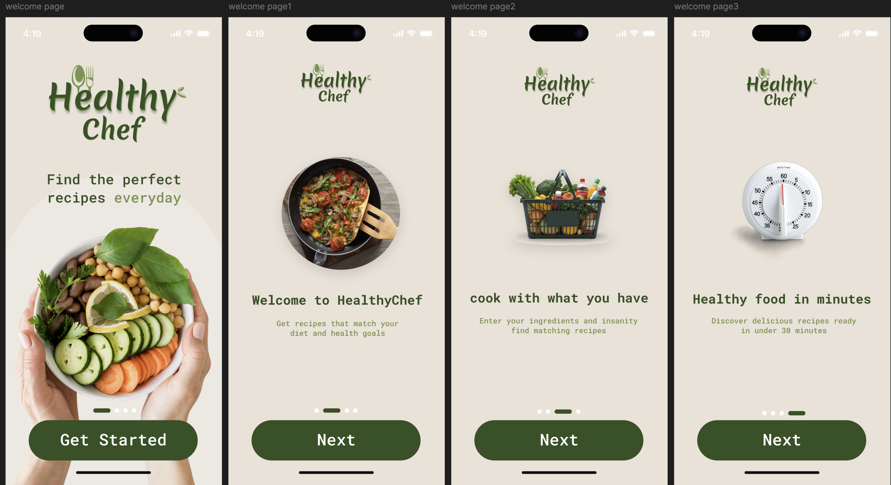
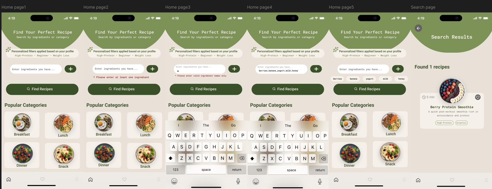
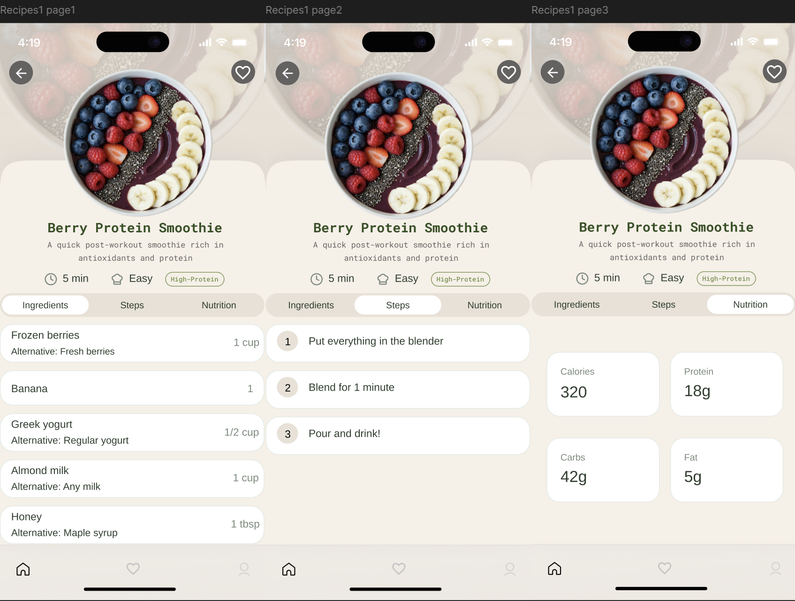

# HealthyChef — Smart Healthy Recipe App

Group university project developed for a Human-Computer Interaction (HCI) course.

HealthyChef is a health-focused recipe application that generates meal ideas based on available ingredients and dietary preferences. The project emphasizes usability, accessibility, and user-centered design.

## 🎨 Figma Prototype
👉 https://www.figma.com/proto/SbrgeNzc7QTfUk3YTX2WK7/Project-280?node-id=0-1&t=LdTe2FjUl6ZmmuH2-1

## 📸 Screenshots

## 🛠 Tools & Methods
- Figma (wireframing & prototyping)
- User-centered design
- Usability testing
- HCI principles
